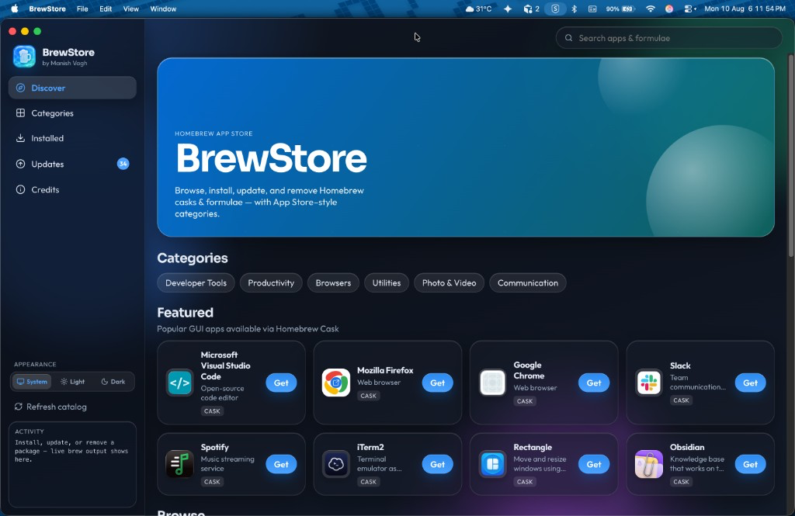
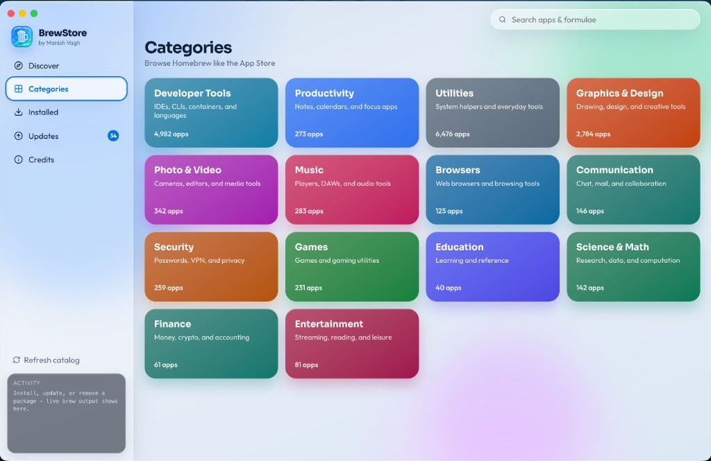
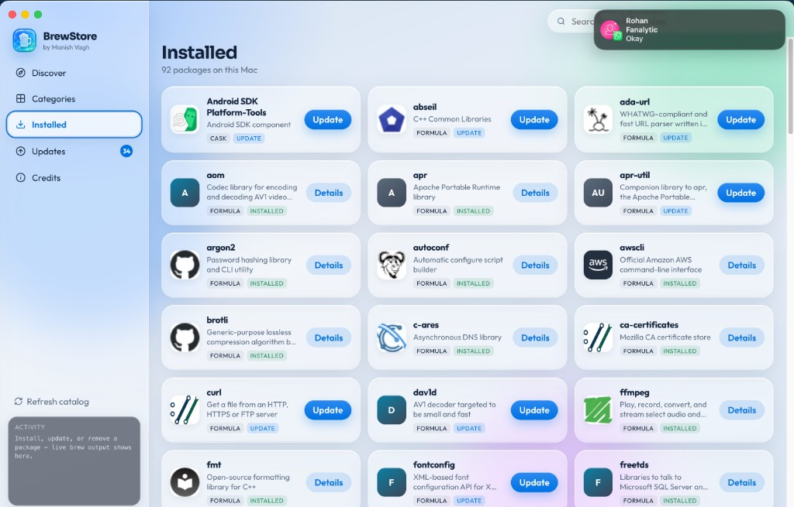
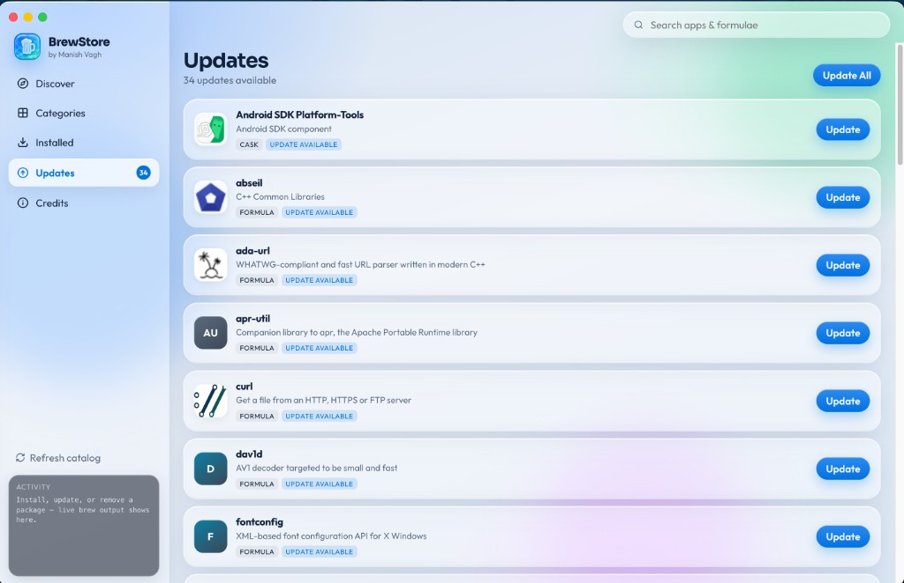
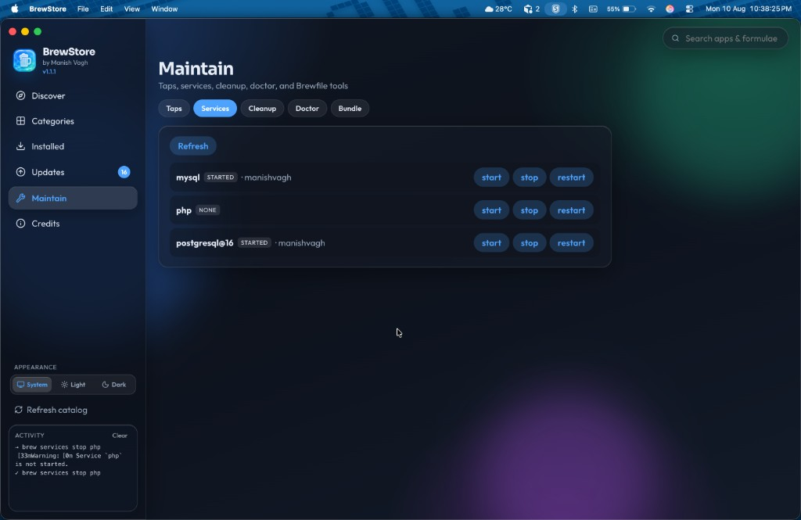
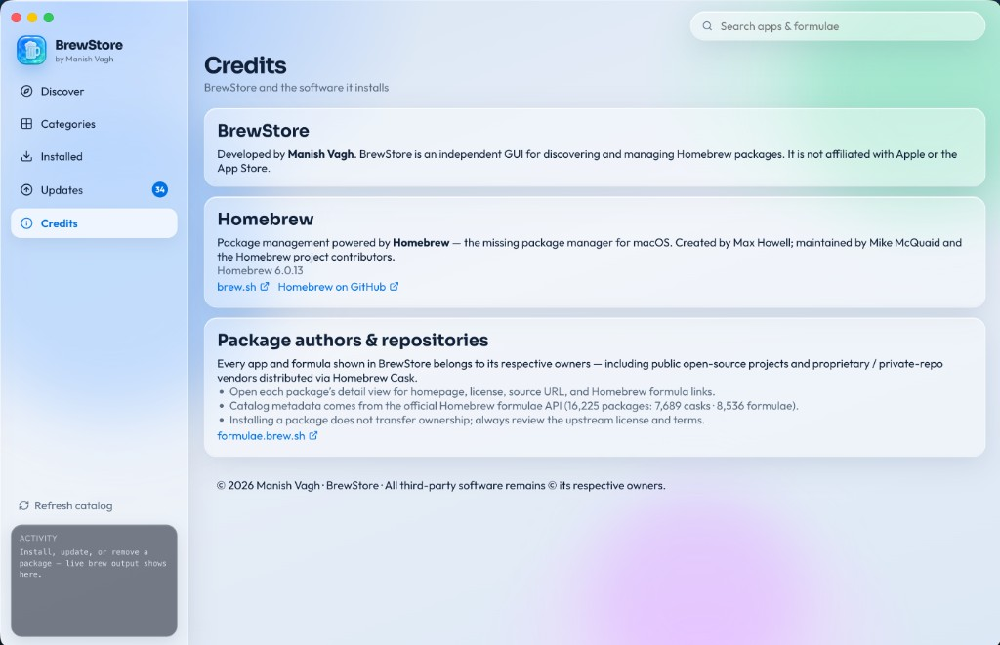

# BrewStore

Native macOS desktop app for **discovering and managing** [Homebrew](https://brew.sh) packages — casks and formulae — with an App Store–style interface.

**Author:** Manish Vagh  
**Official site:** [manishvagh.in](https://manishvagh.in/) · **Source:** [GitHub](https://github.com/manishvagh/BrewStore-by-Manish-Vagh)

Homebrew’s catalog is huge. Nobody remembers every package — or even knows most of them exist. BrewStore shows the full index visually so you can browse, search, and stumble into tools you’d never type into Terminal.

BrewStore is a frontend for Homebrew. It does not replace Homebrew, and it does not claim ownership of any packaged software. Every app and library remains the property of its respective authors and maintainers.

---

## Download

**Latest release (macOS DMG):**  
[Download BrewStore for Mac](https://github.com/manishvagh/BrewStore-by-Manish-Vagh/releases/latest)

Or open [Releases](https://github.com/manishvagh/BrewStore-by-Manish-Vagh/releases) and grab the `.dmg` for your Mac (Apple Silicon or Intel).

After install, if macOS Gatekeeper blocks the app, see [First launch / Gatekeeper](#first-launch--gatekeeper) below.

---

## Why BrewStore?

| Advantage | What you get |
|---|---|
| **See everything Homebrew has** | Browse the full cask + formula catalog visually — find apps you didn’t know were available |
| **Casks and formulae together** | GUI apps and CLI libraries in one place |
| **Search the whole index** | Match on name, token, and description — not only packages you already remember |
| **Explore by category** | Developer Tools, Browsers, Productivity, and more — discover by job, not by package ID |
| **For you & collections** | Suggestions from your installs, plus curated lists like New Mac setup |
| **Trending** | Popular Homebrew installs from public 30-day analytics |
| **Smarter search** | Filters for cask/formula, installed, GUI, open source — plus synonyms |
| **Maintain toolkit** | Taps, services, cleanup, doctor, Brewfile export/import |
| **Safer uninstalls** | See dependents before removal; pin formulae to skip upgrades |
| **Install queue** | Queue several installs and let them run one after another |
| **Open & copy** | Launch installed casks; copy `brew install …` for Terminal |
| **Disk usage** | See how much each installed package uses on disk |
| **Command palette** | ⌘K for search/actions; `/` focuses search |
| **App updates** | Check GitHub Releases for newer BrewStore builds |
| **Details before you install** | Version, type, tap, license, plus homepage / formula / source links |
| **Real app icons** | Local `.app` icons when installed, with remote fallbacks — feels like a store |
| **Full lifecycle** | Install, update, uninstall, and Update All from the UI |
| **Updates at a glance** | Badge + Updates list with progress and live feedback |
| **Live Activity** | Sidebar shows real `brew` output as commands run |
| **Fast catalog + Refresh** | Cached Homebrew API data for quick launch; refresh when you want fresh |
| **Still your Homebrew** | Uses local `brew` — Terminal still works; no account required; free & open source |
| **Homebrew setup help** | If brew isn’t installed, BrewStore finishes setup in-app (password dialog — no Terminal) |
| **Light, dark, or system** | Appearance follows macOS by default, or lock Light / Dark |

---

## Screenshots

### Discover
Browse featured GUI apps, jump into categories, and search the catalog.



### Categories
Explore Homebrew like the App Store — Developer Tools, Utilities, Browsers, and more.



### Installed
See what’s on this Mac, spot updates, and open package details.



### Updates
Review outdated packages and update individually or all at once.



### Maintain
Manage taps, Homebrew services (start / stop / restart), cleanup, doctor, and Brewfile export/import.



### Credits
Attribution for BrewStore, Homebrew, and the authors of every package you install.



---

## Features

- Visual discovery of the full Homebrew catalog (casks + formulae)
- For you recommendations based on installed packages
- Curated collections (New Mac setup, Designers, CLI essentials, Dev stack)
- Trending packages from Homebrew analytics (30-day installs)
- Search with filters (cask/formula, installed, GUI, open source) plus synonyms
- Similar packages on the detail view
- Search across name, token, and description
- Category-based browsing (Developer Tools, Productivity, Browsers, and more)
- Featured apps on Discover for quick starts
- Package detail view with homepage, formula, and source links
- Install, uninstall, and update (including Update All)
- Updates badge, per-package progress, and live Activity log
- Maintain tools: taps, services, cleanup, doctor, Brewfile export/import
- Pin formulae, dependency lists, and uninstall warnings when others need a package
- Install queue for multiple packages
- Open installed casks; copy brew install commands
- Disk usage on the Installed view
- ⌘K command palette and keyboard shortcuts
- Check for BrewStore updates via GitHub Releases
- Package icons (local `.app` when installed, remote fallbacks)
- Catalog cache with Refresh catalog
- Onboarding when Homebrew isn’t installed (in-app setup with macOS password dialog)
- Appearance: System, Light, or Dark (persisted)
- Credits and attribution for Homebrew and package owners
- Free, open source, no account

---

## Requirements

| Dependency | Notes |
|---|---|
| macOS | Apple Silicon or Intel |
| [Homebrew](https://brew.sh) | Must be installed and working in Terminal |
| [Node.js](https://nodejs.org/) 20+ | Required only to build or run from source |

Check Homebrew:

```bash
brew --version
```

---

## Quick start (development)

```bash
git clone https://github.com/manishvagh/BrewStore-by-Manish-Vagh.git
cd BrewStore-by-Manish-Vagh
npm install
npm run dev
```

This starts the Vite dev server and opens the Electron window. Use this while hacking on the UI or brew integration.

---

## Install as a macOS app

### Option A — Download the DMG (recommended)

1. Get the latest build from [GitHub Releases](https://github.com/manishvagh/BrewStore-by-Manish-Vagh/releases/latest)
2. Open the `.dmg`, drag **BrewStore** into **Applications**
3. Launch from Launchpad, Spotlight, or Applications

### Option B — Build from source

Build a packaged `.app`, install it into `/Applications`, and ensure Homebrew is present (installs Homebrew during this step if needed — macOS may ask for your password):

```bash
git clone https://github.com/manishvagh/BrewStore-by-Manish-Vagh.git
cd BrewStore-by-Manish-Vagh
npm install
npm run install:mac
```

Then open **BrewStore** from Launchpad, Spotlight, or Applications.

### Manual package (without copying to Applications)

```bash
npm install
npm run dist:dmg
open release/BrewStore-*-arm64.dmg
```

`npm run dist` builds the `.app` only; `npm run dist:dmg` also produces the distributable disk image.

On Intel Macs the artifact arch may be `x64` instead of `arm64`.

### First launch / Gatekeeper

The app is unsigned by default. If macOS blocks it:

1. System Settings → Privacy & Security → allow the app, **or**
2. Right-click BrewStore → Open → Open, **or**
3. Clear quarantine attributes:

```bash
xattr -cr /Applications/BrewStore.app
```

---

## Scripts

| Command | Description |
|---|---|
| `npm run dev` | Development mode (Vite + Electron) |
| `npm run build` | Typecheck and build the renderer |
| `npm run dist` | Build renderer and package the macOS `.app` |
| `npm run dist:dmg` | Build renderer and package a macOS `.dmg` for distribution |
| `npm run install:mac` | Package, install into `/Applications`, set up Homebrew if missing |
| `npm start` | Run Electron against the built `dist/` folder |
| `npm run lint` | Run Oxlint |

---

## Using the app

1. **Discover** — browse the catalog, featured apps, and search  
2. **Categories** — explore by App Store–style groups  
3. **Installed** — packages on this Mac; details, update, or uninstall  
4. **Updates** — outdated packages; Update or Update All  
5. **Maintain** — taps, services, cleanup, doctor, and Brewfile tools  
6. **Credits** — author and third-party attribution  

The sidebar **Activity** panel shows live `brew` output. Use **Refresh catalog** to force a fresh download of the Homebrew formulae/cask index (otherwise cached for 12 hours).

---

## Project layout

```
BrewStore/
├── electron/          # Main process, brew bridge, icons
├── src/               # React UI
├── docs/screenshots/  # README screenshots
├── scripts/           # electron-builder hooks
├── build/             # App icons (.icns / .png)
├── public/            # Static assets bundled into the renderer
└── package.json
```

Homebrew is invoked through the local `brew` CLI. Catalog metadata is loaded from the official Homebrew APIs:

- https://formulae.brew.sh/api/cask.json  
- https://formulae.brew.sh/api/formula.json  

---

## Contributing

Direct commits to `main` are not allowed. Open a pull request and wait for review/approval from the repository owner. See [CONTRIBUTING.md](./CONTRIBUTING.md).

---

## Credits

- **BrewStore** — developed by Manish Vagh  
- **Homebrew** — Max Howell, Mike McQuaid, and the Homebrew project  
- **Packages** — all casks and formulae belong to their respective owners (open-source and proprietary). Open a package’s detail view for homepage, license, and formula links.

BrewStore is not affiliated with Apple or the App Store.

**Official sources only:** [GitHub](https://github.com/manishvagh/BrewStore-by-Manish-Vagh) · [manishvagh.in](https://manishvagh.in/)

---

## Trademark

The code is open source (MIT). The **BrewStore** name and **Manish Vagh** product attribution are not.

Forks and modified builds are welcome under MIT, but must not pretend to be the official BrewStore. Rename your fork, keep the copyright notice, and say it is based on BrewStore by Manish Vagh. Full rules: [TRADEMARKS.md](./TRADEMARKS.md) · [NOTICE](./NOTICE).

---

## License

MIT — see [LICENSE](./LICENSE).

Homebrew and third-party packages are covered by their own licenses.
